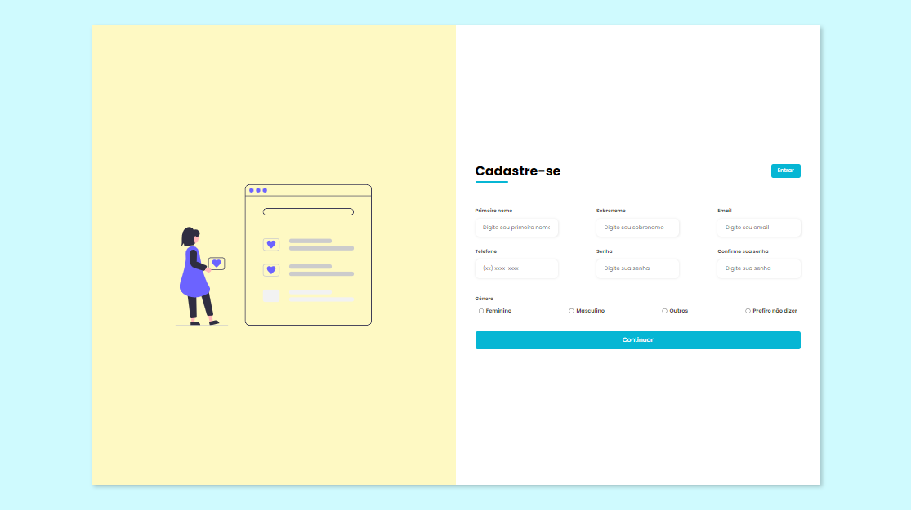

# Formulário de Cadastro Responsivo

[🔗 Clique aqui para acessar] (https://karenveras.github.io/Formulario-Cadastro-Responsivo/)

> Criei esse formulário modo responsivo, ou seja, ele se adequa ao tamanho da página, usando apenas CSS e HTML.

## 🚀 Tecnologias
- HTML
- CSS
- Git
- Github

## 📭 Contato
karen.abelini@gmail.com